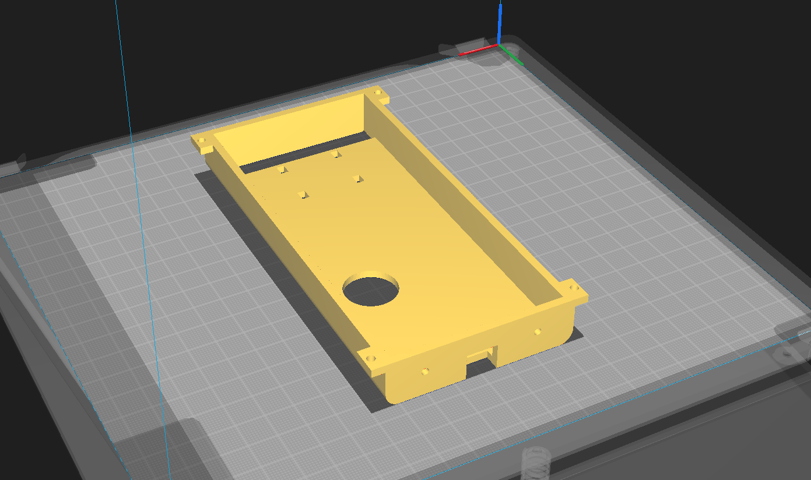

## CAD Design

For the housing of the device, I decided to design it in AutoDesk Inventor. It consisted of an upper and lower portion.

For the top portion, I had to design the piece so that there was space for the buzzer hole and the USB connection to the Arduino so that I did not have to disassemble it every time I needed to update the code. Also had to ensure space for the mini-bread board for the circuits connection and a gap for the motor off-set weight so spins freely. I left a gap so that my professor could see it in action while in runtime. At each corner of the part, I designed sections for screw holes that will join the top and bottom parts.

Here is the Result:

For the bottom part, I designed the part to ensure the fitting of the Arduino, USB, and battery pack. And along the border corners the screw holes to join the parts was also added.

Here is the Result:

