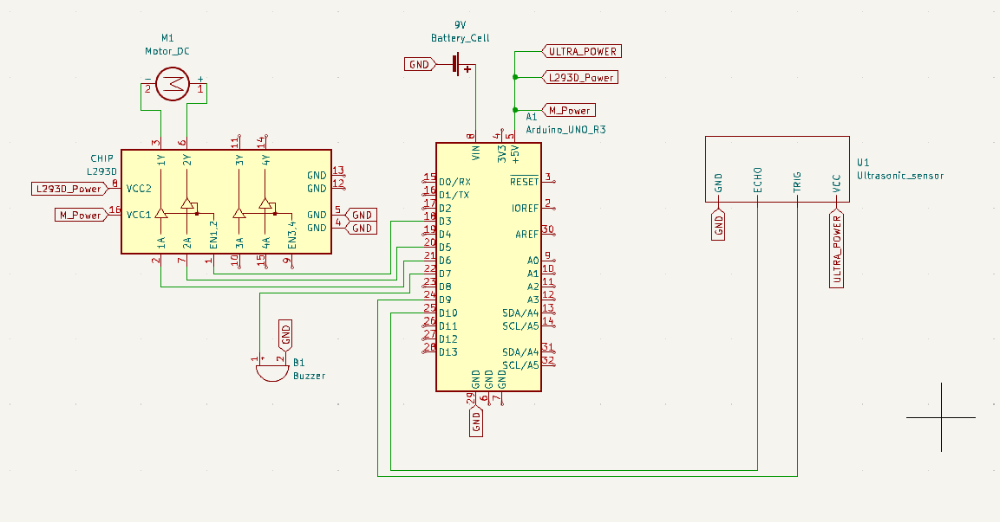
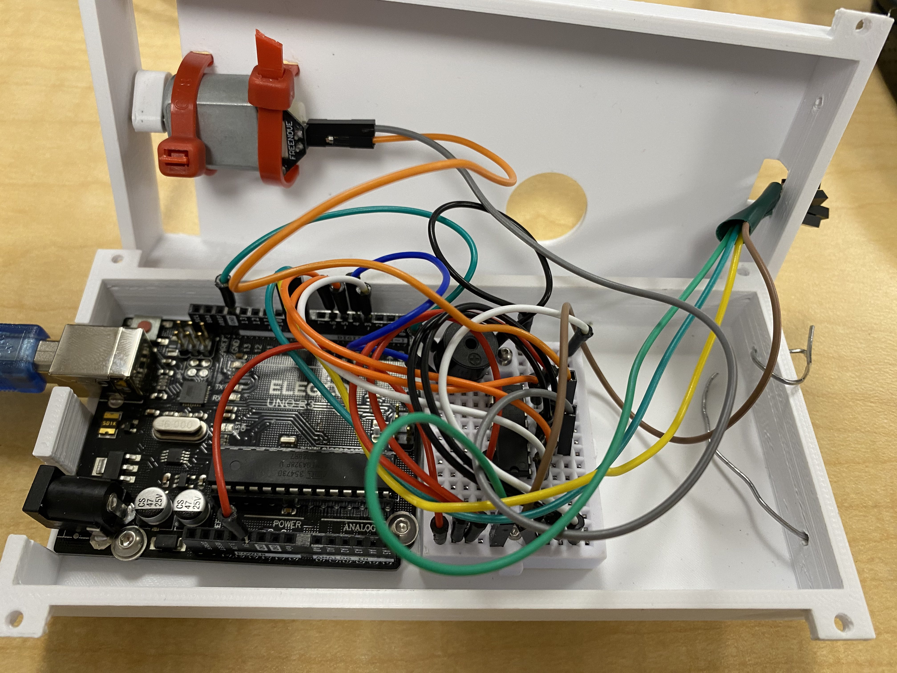

## Circuit Design

I decided to use the Arduino platform and as my 2 outputs, I used a 5V DC motor and active buzzer. And my input device was an ultrasonic sensor. I used a 9V battery to power this system.

The idea of the project was to provide a handheld device for the blind, that would help them avoid physical obstacles. The system consisted of using the ultrasonic sensor to detect objects at certain ranges. At certain ranges, the DC motor will start spinning with an attached offset weight that will induce a vibration in the device.

This is the 3D-printed offset weight:

This will alert the user and the closer the user approaches the obstacle the more aggressive the vibration. If the user is at an extremely unsafe distance the buzzer will alarm alerting others nearby for assistance.

This is the Circuit Design:

In order to control the speeds of the Motor I used a L293D driver and PWM pins on the Arduino. By enabling these pins I was able to set speeds depending on what the ultra-sonic sensor data output.

The end result:

