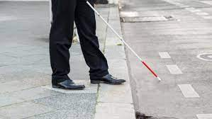
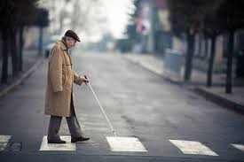

# Prototype-Sensor-For-Blind
The project was built during my Engineering 2200 Class. We were given freedom of choice for the project but it had to have 2 outputs and one input.

So I decided to design a device that could be substituted for a white cane. This makes it easier to navigate through obstacles without having to have harsh interactions with physical obstacles.

